# ann_sampling
This repository contains supplementary run files, data and analysis scripts used in the paper 
**Learning Free Energy Landscapes Using Artificial Neural Networks** by Hythem Sidky and 
Jonathan K. Whitmer. 

## What's inside? 
- Gromacs and LAMMPS topology, configuration and run parameters.
- SSAGES input files for ANN sampling, metadynamics and adaptive biasing force (ABF).
- Plumed 2 input files for variationally enhanced sampling. 
- Select output free energy surfaces for plotting.
- Jupyter notebooks containing analysis and plotting code. 

## Alanine dipeptide in water
ADP is a standard system used to benchmark free energy methods. The two dihedrals forming 
the Ramachandran plot, phi and psi, are used as collective variables (CVs). In this 
example, we estimate the two-dimensional free energy landscapes for ADP in water using 
four different methods: ANN sampling (proposed method), metadynamics, adaptive biasing 
force (ABF), and variationally enhanced sampling. It's important to note that we simulate 
*ADP in water*, as opposed to *vacuum*. The dynamics are slower and biasing on the two 
mentioned CVs can highlight the strengths/weaknesses of a method. 

Simulations were run using a private branch of [SSAGES](https://github.com/MICCoM/SSAGES-public) 
v0.7.5 compiled against 
[Gromacs 2016.3](http://manual.gromacs.org/documentation/2016.3/download.html). The only 
modification to the public release is the addition of ANN sampling which will be released 
once this paper is published. The system simulated consists of a single ADP molecule, 
modeled using Amber99sb forcefield, and 878 TIP3P waters. Temperature and pressure were 
maintained at 298.15 K and 1 bar using the stochastic velocity rescaling thermostat and 
Parrinello-Rahman barostat respectively. All of the relevant Gromacs files can be found 
[here](alanine_dipeptide/system). Below is a comparison and brief discussion of the results.

### ANN sampling

Six different sets of parameters are used to generate an estimate of the ADP FES using 
ANN sampling. All neural networks contained two hidden layers. The number of neurons in 
each layer was varied, and the sweep interval for training the neural network was varied. 
A grid of 31x31 points was used to accumulate the estimate of the partition function. 
The result in the main paper used a 60x60 grid, and convergence is indistinguishable from 
these results. Greater resolution can be obtained by evaluating the neural network on a 
finer mesh. In fact, the final neural network is entirely portable and can be used to 
"prime" other similar systems or used for other purposes. See the 
[jupyter notebook](alanine_dipeptide/ann/ann_plot_data.ipynb) for an example of this.  
The table below summarizes the parameters used.

| ID | Architecture | Sweep interval | 
|----|--------------|----------------|
| 1  |   (8, 4)     |      10 ps     |
| 2  |   (8, 4)     |      20 ps     |
| 3  |   (10, 6)    |      10 ps     |
| 4  |   (10, 6)    |      20 ps     |
| 5  |   (10, 6)    |       5 ps     |
| 6  |   (12, 8)    |      10 ps     |

The free energy surfaces obtained 5 nanoseconds are shown below.

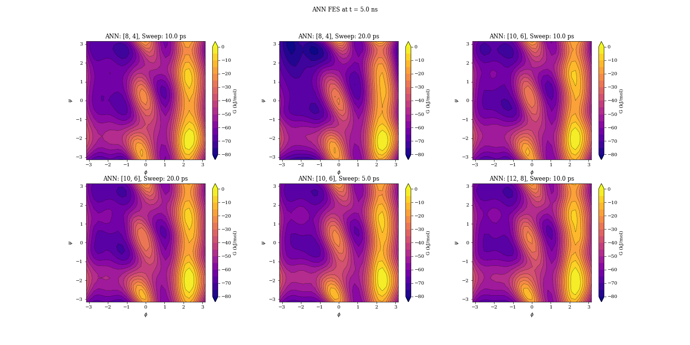

The free energy surfaces at 5 nanoseconds are converged. Very minor differences are due to
fluctuating bias around the average FES. In these examples, we turn on averaging at 3ns.
For more plots, and illustration of convergence, and details on the analysis check out the 
[jupyter notebook](alanine_dipeptide/ann/ann_plot_data.ipynb). We can see from the notebook 
that the [8, 4] networks struggle a bit more than the other examples, especially with a 
larger stride. This represents the limit of small network for this system, which contains 
*just* (or maybe not) enough flexibility to appropriately capture the FES. In a realistic 
application where the complexity of the free energy landscape is unknown, a user would 
specify an arbitrarily large network which would self-regularize. Here we were interested 
in identifying the minimum network size necessary for a reasonable representation of the 
surfaces.

A few things to keep in mind: 

- All networks resolve the FES in very similar times. 
- As illustrated in the main paper, due to Bayesian regularization, larger networks will 
  yield similar results.
- The figures above show the FES as negative of the bias. Another estimate can be obtained 
  from the unbiased histogram found in the data files.
- Plotting a free energy estimate from the unbiased histogram will show a noisy surface. 
  This is an example of the power of the BRANN yielding a smooth approximation of noisy 
  data (robust to overfitting).

The free energy was also estimated using many different architectures and strides not shown here, 
all yielding  very similar results. The networks shown here just serve as an example. Feel free to take any 
of the input files and test your own set of parameters. ANN sampling is quite robust to choice 
of parameters and will converge rapidly over a very broad range of (sub)-optimal parameter 
choices.

### Metadynamics 

Standard metadynamics was run with hill widths of (0.30, 0.30) radians, a hill height of 
0.3 kJ/mol and a drop rate of 2 ps. The hills were evaluated on a 500x500 grid. These 
parameters were adapted from 
[Vymětal, J., & Vondrášek, J. (2010). J Phys Chem B, 114(16), 5632–5642.](https://doi.org/10.1021/jp100950w) 
Below are plots of the free energy surface at 5, 10, 20 and 40 nanoseconds. As with the ANN 
sampling plots, they are not averaged.

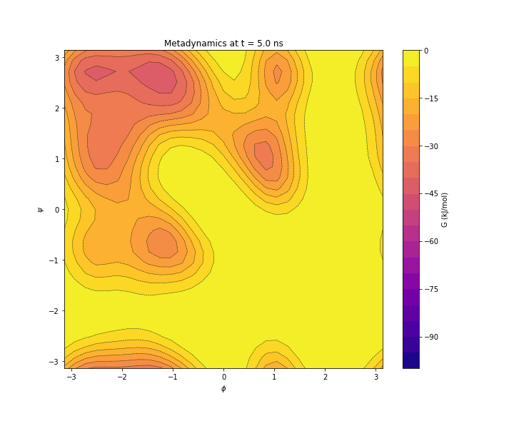
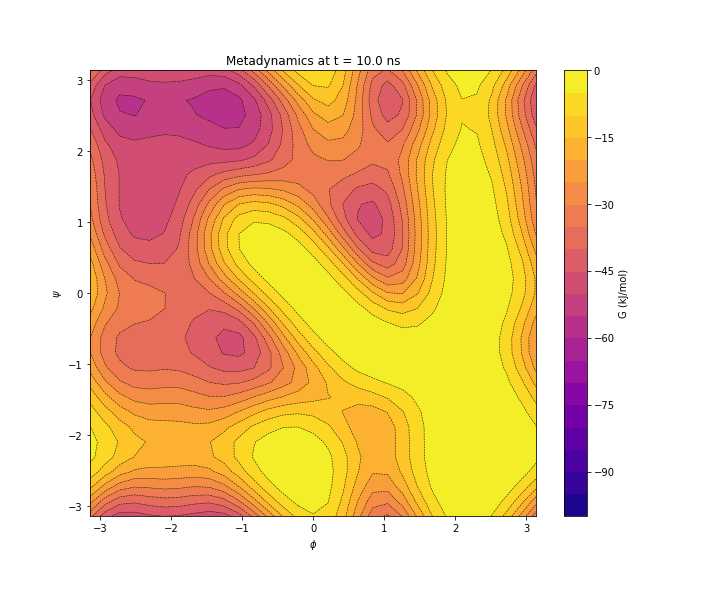
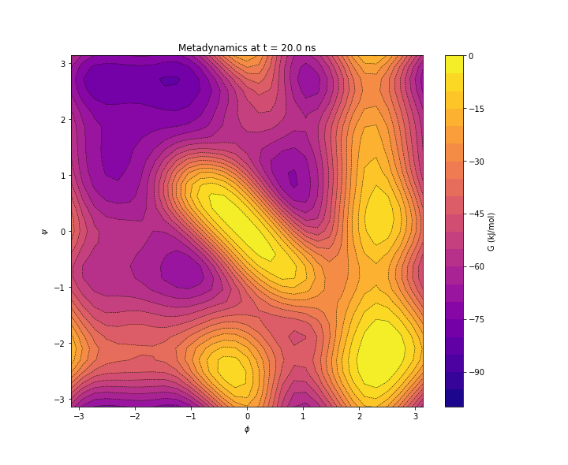
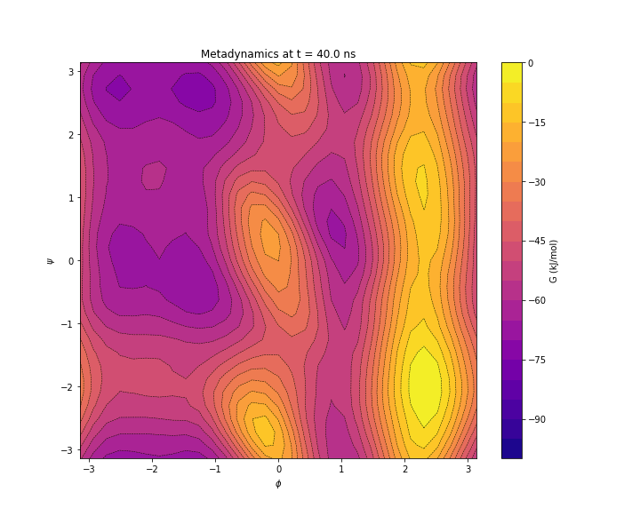

It is clear that the FES is not yet fully sampled at 10 nanoseconds, and at 20ns, there 
is an exaggerated feature around (0, 0), which takes another 20 nanoseconds to resolve. 
The convergence time we find is commensurate with the amount of time reported in the 
paper (40ns flooding, 20ns averaging interval). The authors mention in their work that 
they chose their parameters "on the basis of our previous experience and the pilot calculations 
as a compromise between a fine resolution and the computational cost." We point this out 
because if you are unhappy with the the choice of parameters then this only reinforces the 
strength of ANN sampling: 

- Metadynamics parameters require a lot of tuning to get right. This includes estimates of 
  the feature size, diffusion time, etc... 
- It is hard to get both rapid convergence and good resolution using metadynamics especially 
  without prior knowledge of the free energy landscape. 
- ANN sampling clearly converges in an order of magnitude less time. 
- ANN sampling converges rapidly for a variety of chosen parameters.

For more on the metadynamics data and analysis, check out the 
[Jupyter notebook](alanine_dipeptide/meta/meta_plot_data.ipynb).

### Adaptive biasing force 

ABF was run on a 31x31 grid with a linear ramp interval of 100 hits per bin. Beyond these 
two parameters, there really aren't any other parameters to specify. Below are the figures 
for ABF at 5, 10, 20 and 40 nanoseconds. 

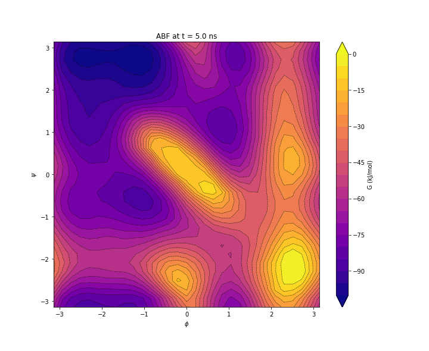
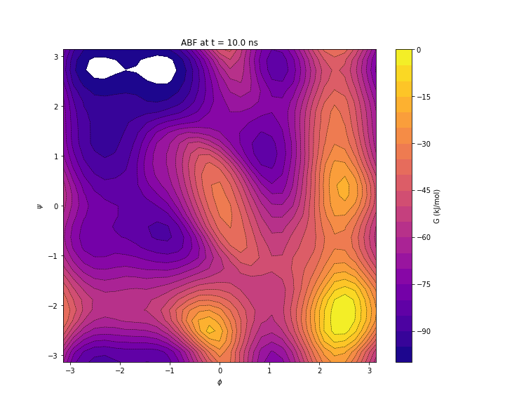

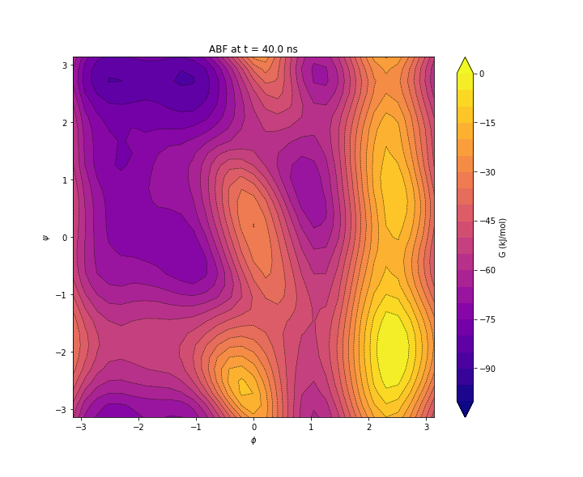

ABF looks like it does does better than metadnyamics early on, but still takes some time 
to correct the central distortion. In fact, we find that metadynamics handles this better 
than ABF, requiring less time to resolve. The reason for this is ABF accumulates an average 
of the mean force at each bin, which requires a substantial number of hits to correct once 
ADP is able to access the proper conformation at (0,0).

For more on the ABF data and analysis, check out the 
[Jupyter notebook](alanine_dipeptide/abf/abf_plot_data.ipynb).

### Variationally enhanced sampling

Variationally enhanced sampling (VES) was run using [plumed-ves](github.com/ves-code/plumed2-ves)
patched into Gromacs 2016.3. Order 15 Fourier series were used along each dimension with a 
31x31 grid and a stride of 500. The plumed input file can be found 
[here](alanine_dipeptide/ves/plumed.dat). Below are the figures for VES at 5, 10, 20, and 40 
nanoseconds.

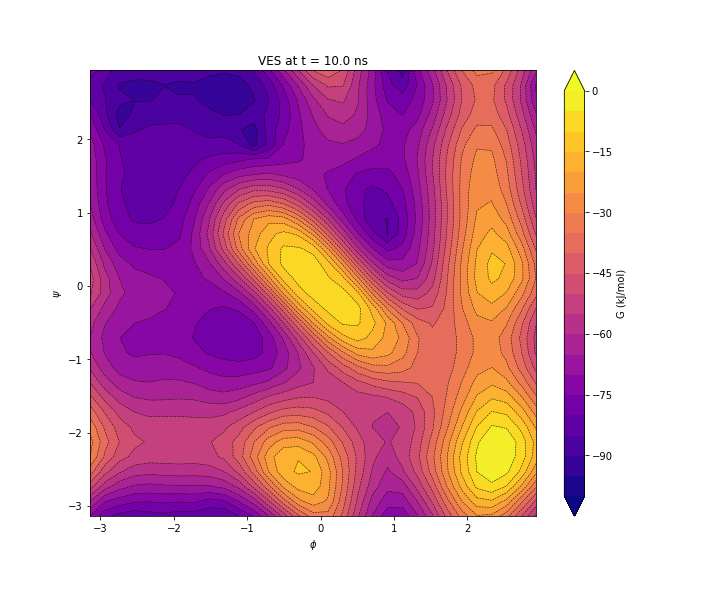
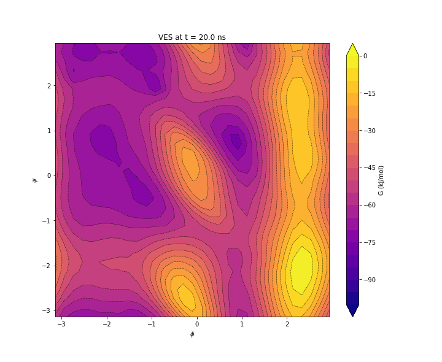
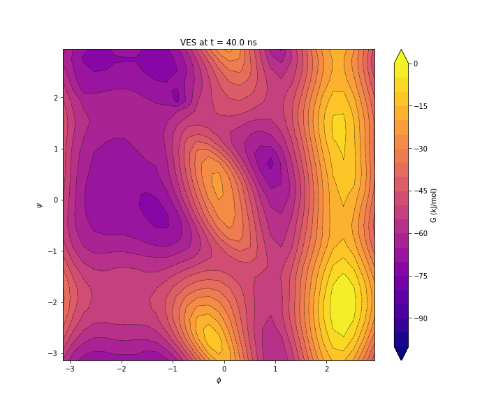

VES performs better than ABF and similar (perhaps a bit faster) than metadynamics. 
The parameters used for the VES optimizer were not necessarily optimal, and were set based on 
examples in the documentation. Keep in mind as well, that the power of VES lies not 
necessarily in the speed of convergence alone, but in the many features allowed by it 
such as targeted probability distributions and high dimensional sampling.

## Rouse modes of an ideal Gaussian chain 

This example uses the first three 
[Rouse modes](http://www.eng.uc.edu/~beaucag/Classes/Physics/DynChapter6html/Chapter6.html)
of an ideal Gaussian chain, whose free energy is known analytically. The three-dimensional 
free energy volume is resolved using ANN sampling and compared against the analytical 
results by integrating out each of the two dimensions. The results are shown below: 

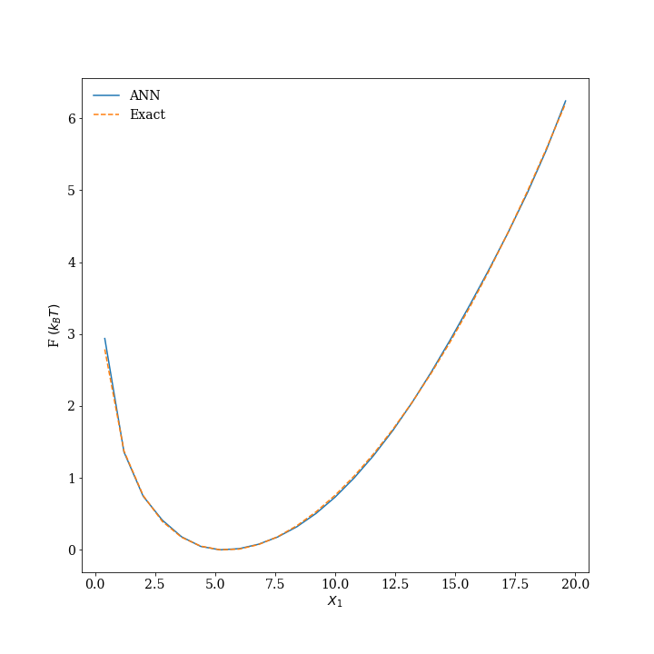
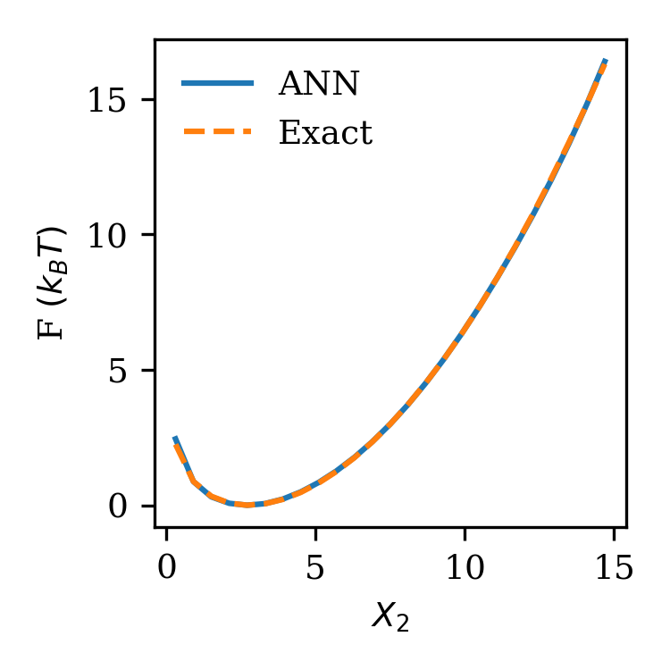
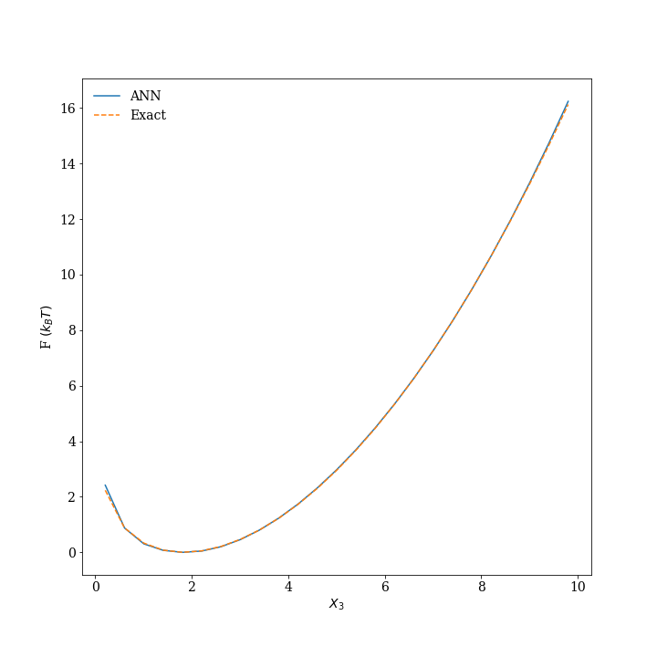

We can see that exact agreement is achieved with ANN sampling which demonstrates the correctness 
of the method and its ability to resolve higher dimensional surfaces. 

## Backbone dihedrals of alanine tripeptide in vacuum

Alanine tripeptide (Ace-Ala-Ala-Nme) has four primary dihedrals making up two 
psi-phi Ramachandran plots. In this example we sample on all four dihedrals which is similar 
to that reported in [Stecher, T., Bernstein, N., & Csányi, G. (2014). JCTC, 10(9), 4079–4097.](https://doi.org/10.1021/ct500438v) except in our example we use the Amber99sb forcefield as
opposed to CHARMM. We use a (24, 20) network with a 20x20x20x20 grid and a sweep length of 20 ps.
The FELs projected onto the two Ramachandran plots are shown below. 

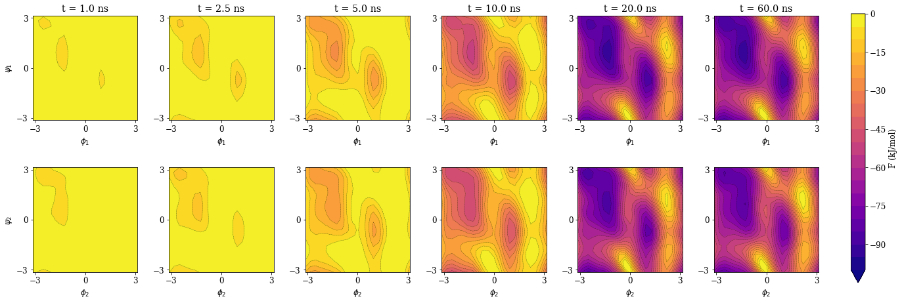

The FEL converges somewhere around the 15-20 nanosecond mark which is quite remarkable for 
a 4D landscape. In comparison, Gaussian process regression umbrella sampling required a 
combined 1.3 microseconds to converge. Also, as a point of reference, the *three* dimensional 
FEL for ala3 took 50-100 nanoseconds to converge using VES.  

## Remarks 

Hopefully these examples has made it abundantly clear how powerful ANN sampling can be, 
how forgiving it is to the end user, its dramatically fast convergence and how it is well 
suited for expensive simulations or less-than-deal CVs. We hope ANN sampling becomes a staple
advanced sampling routine in the molecular modeler's toolkit. For more information on the 
method itself and a discussion of the results shown above, refer to the publication. 
